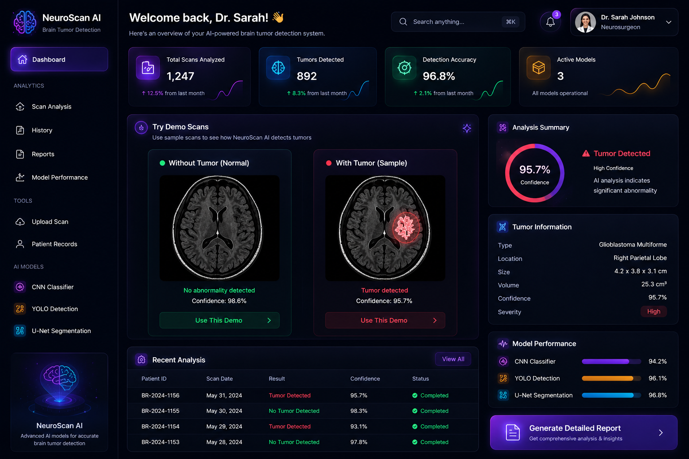
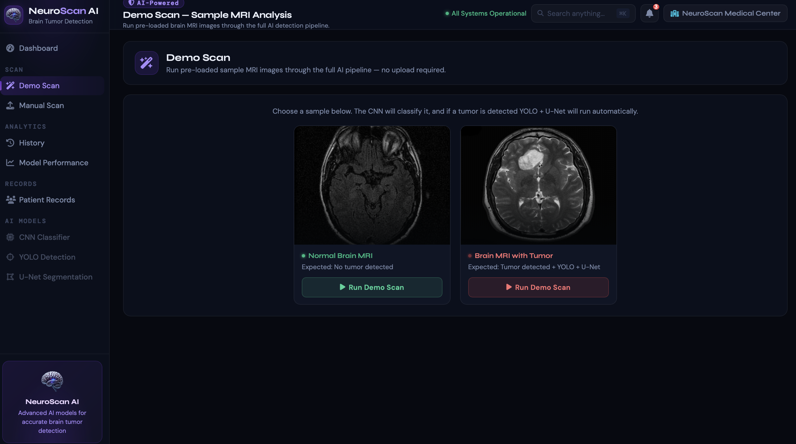
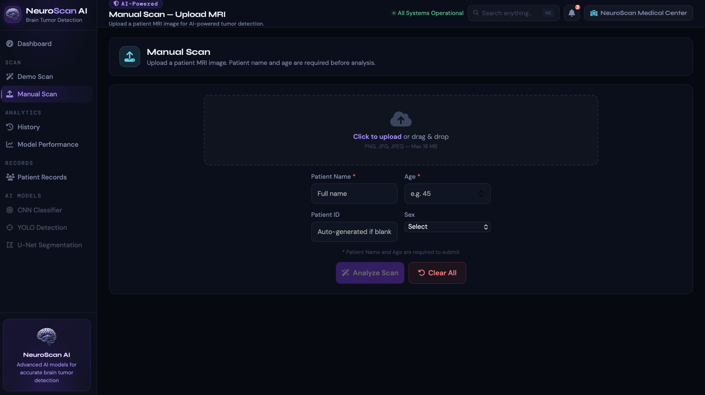
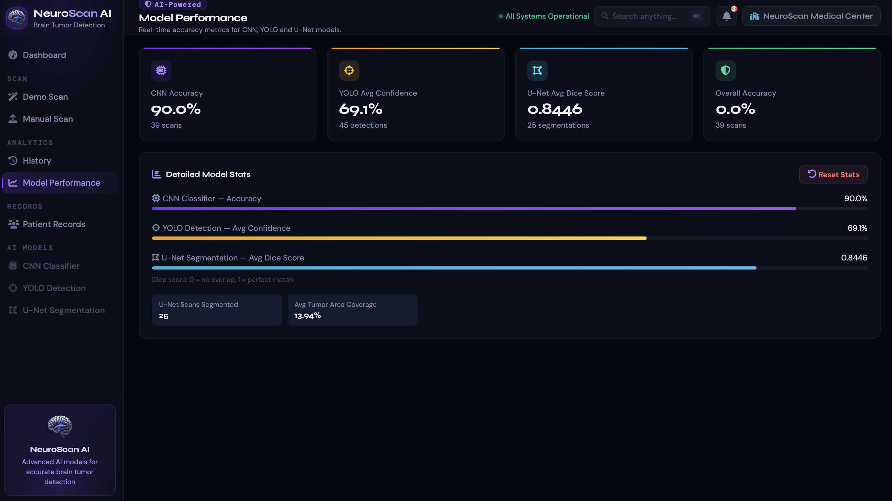
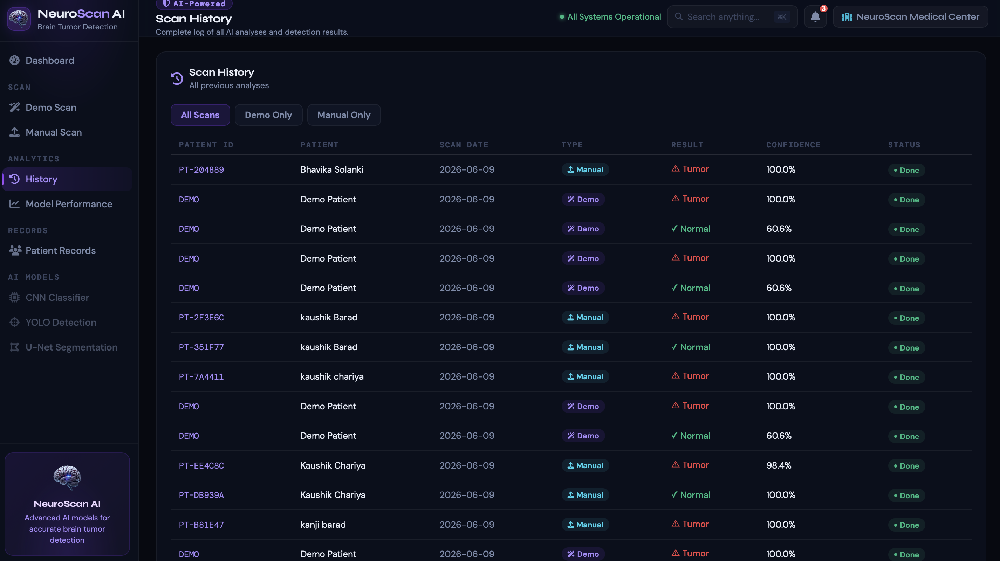
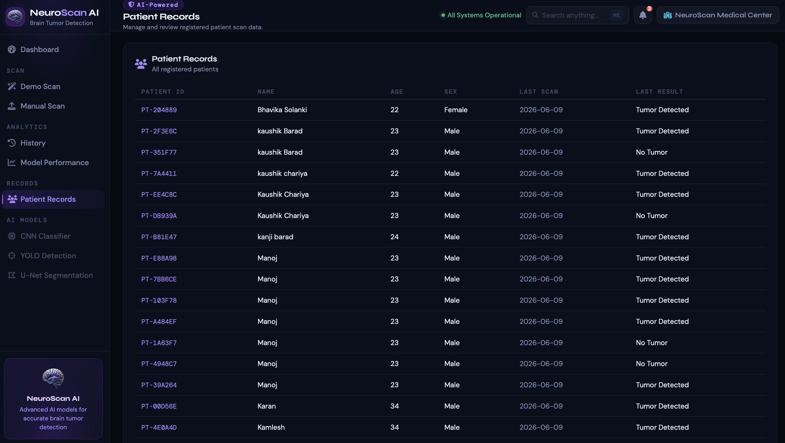
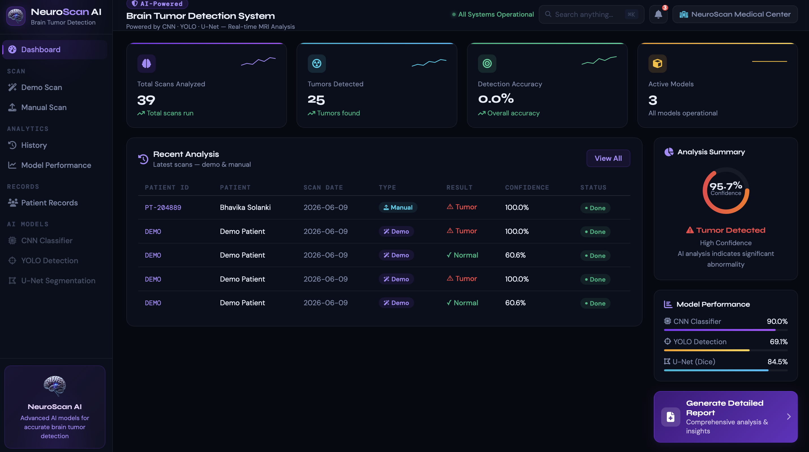

<div align="center">



<br/>
<br/>

<h1>🧠 NeuroScan AI</h1>
<h3>AI-Powered Brain Tumor Detection & Segmentation System</h3>

<br/>

[](https://python.org)
[](https://flask.palletsprojects.com)
[](https://tensorflow.org)
[](https://pytorch.org)
[](https://docker.com)
[](https://aws.amazon.com)
[](https://dvc.org)
[](LICENSE)

<br/>

> **NeuroScan AI** is a full-stack, production-grade deep learning system that detects, localizes, and segments brain tumors from MRI scans — combining **CNN**, **YOLOv8**, and **U-Net** models into a single intelligent pipeline with automated PDF report generation and a fully deployed cloud infrastructure.

<br/>

🌐 **Live Demo:** [`http://34.234.78.94:8000`](http://34.234.78.94:8000)

<br/>

</div>

---

## 📸 App Preview

<div align="center">


<br/><sub><b>🏠 Main Interface — Upload MRI scans and trigger the full detection pipeline</b></sub>

</div>

---

## ✨ Key Features

<table>
<tr>
<td width="50%">

**🔬 CNN Classification**
Binary tumor detection with confidence scoring using a custom TensorFlow/Keras model trained on BraTS 2021.

**📦 YOLOv8 Detection**
Real-time bounding box localization of tumor sub-regions — Necrotic, Edema, and Enhancing tissue.

**🎯 U-Net Segmentation**
Pixel-level tumor mask with Dice score and coverage percentage via segmentation-models-pytorch.

**📄 PDF Report Generation**
Fully automated diagnostic report with all 3 annotated MRI images, stats, and patient info.

</td>
<td width="50%">

**🏥 Patient Management**
Track patient records and full scan history with searchable archive.

**📊 Model Performance Dashboard**
Live accuracy, confidence, and segmentation statistics across all runs.

**🖼️ DICOM Support**
Upload `.dcm` medical imaging files directly alongside standard PNG/JPG formats.

**🚀 Demo Mode**
Instant try-out with built-in Normal & Tumor sample scans — no upload needed.

</td>
</tr>
</table>

---

## 🖼️ Screenshots

### 🔬 MRI Scan Analysis & Demo Mode

<div align="center">

<br/><sub><b>Demo Mode — Run pre-loaded Normal or Tumor MRI scans instantly</b></sub>
</div>

<br/>

### 📋 Manual Upload & Prediction

<div align="center">

<br/><sub><b>Manual Upload — Drag & drop your MRI scan and run the full 3-stage AI pipeline</b></sub>
</div>

<br/>

### 📊 Model Performance Dashboard

<div align="center">

<br/><sub><b>Live Stats — Track CNN accuracy, YOLO confidence, U-Net Dice scores across all scans</b></sub>
</div>

<br/>

### 🕓 Scan History

<div align="center">

<br/><sub><b>Scan History — Browse, review, and download reports for every past scan</b></sub>
</div>

<br/>

### 🏥 Patient Records

<div align="center">

<br/><sub><b>Patient Management — Add, view, and manage patient profiles with linked scan history</b></sub>
</div>

<br/>

### 📈 Full Dashboard Overview

<div align="center">

<br/><sub><b>Dashboard Overview — All system stats and recent activity at a glance</b></sub>
</div>

---

## 🏗️ System Architecture

```
MRI Input (PNG / JPG / DICOM)
          │
          ▼
┌─────────────────────┐
│    CNN Classifier    │  ← TensorFlow / Keras  │  128×128, Binary
│   (Tumor / Normal)   │
└──────────┬──────────┘
           │
      Tumor Detected?
      ┌────┴────┐
     YES        NO
      │          │
      ▼          ▼
 ┌─────────┐   Return Original MRI only
 │  YOLOv8  │  ← Ultralytics (PyTorch)  │  640×640, 3 classes
 │Detection │
 └────┬─────┘
      │
      ▼
 ┌───────────────┐
 │     U-Net     │  ← segmentation-models-pytorch  │  128×128, 4 classes
 │ Segmentation  │
 └──────┬────────┘
        │
        ▼
   PDF Report + Dashboard
```

---

## 🤖 Models

| Model | Framework | Task | Classes | Input Size | Epochs |
|---|---|---|---|---|---|
| **CNN** | TensorFlow / Keras | Binary Classification | 2 (Tumor / Normal) | 128×128 | 30 |
| **YOLOv8x** | Ultralytics / PyTorch | Object Detection | 3 (Necrotic, Edema, Enhancing) | 640×640 | 100 |
| **U-Net** | segmentation-models-pytorch | Semantic Segmentation | 4 (BG, Necrotic, Edema, Enhancing) | 128×128 | 50 |

**Dataset:** BraTS 2021 (Brain Tumor Segmentation Challenge) | **Trained on:** Kaggle GPU (P100)

| Model | Optimizer | Loss Function |
|---|---|---|
| CNN | Adam | Binary Crossentropy |
| YOLOv8 | SGD | CIoU + BCE (conf=0.25, IoU=0.40) |
| U-Net | Adam | Dice Loss + BCE |

---

## 📄 PDF Diagnostic Report

Every scan automatically generates a **downloadable PDF report** containing:

- ✅ Patient Info (ID, Name, Age, Sex)
- ✅ Diagnosis Result (Tumor Detected / Not Detected)
- ✅ Confidence Score & Classification Label
- ✅ YOLO Localization Table (Bounding Boxes, Class, Confidence per region)
- ✅ U-Net Segmentation Stats (Tumor Area, Coverage %, Dice Score)
- ✅ All 3 annotated MRI images (Original → YOLO Detection → U-Net Mask)
- ✅ Medical Disclaimer
- ✅ Author & Institution Details

---

## 🚀 Quick Start

### Option 1 — Docker (Recommended)

```bash
# Clone the repo
git clone https://github.com/kaushik-chariya/NeuroScan-AI.git
cd NeuroScan-AI

# Pull models via DVC
dvc pull

# Build and run
docker-compose up --build
```

> App will be live at: **`http://localhost:8000`**

---

### Option 2 — Local Setup

```bash
# Clone
git clone https://github.com/kaushik-chariya/NeuroScan-AI.git
cd NeuroScan-AI

# Create virtual environment
python -m venv venv
source venv/bin/activate       # Windows: venv\Scripts\activate

# Install dependencies
pip install -r requirements.txt

# Pull models
dvc pull

# Run
python app.py
```

---

## 🐳 Docker Commands

```bash
# Build image
docker build -t neuroscan-ai .

# Run container
docker run -d -p 8000:8000 --name neuroscan --restart always neuroscan-ai

# Stop container
docker stop neuroscan

# View logs
docker logs -f neuroscan
```

---

## ☁️ Deployment — AWS EC2 + ECR + CI/CD

Full automated deployment pipeline:

```
Git Push
   │
   ▼
GitHub Actions
   │
   ├── DVC Pull (DagHub) → Download trained models
   ├── Docker Build      → Build production image
   ├── ECR Push          → Push to AWS Elastic Container Registry
   └── EC2 Deploy        → SSH pull & restart container on EC2
```

### Infrastructure

| Component | Technology |
|---|---|
| Cloud | AWS EC2 (t2.micro, Ubuntu 22.04) |
| Registry | AWS ECR (Elastic Container Registry) |
| Model Storage | DagHub (DVC remote) |
| CI/CD | GitHub Actions |
| Server | Gunicorn (production WSGI) |

### GitHub Secrets Required

| Secret | Description |
|---|---|
| `AWS_ACCESS_KEY_ID` | AWS IAM Access Key |
| `AWS_SECRET_ACCESS_KEY` | AWS IAM Secret Key |
| `AWS_REGION` | `us-east-1` |
| `ECR_REPOSITORY` | `neuroscanai` |
| `EC2_HOST` | EC2 Public IP |
| `EC2_SSH_KEY` | EC2 `.pem` private key content |
| `DAGSHUB_USER` | DagHub username |
| `DAGSHUB_TOKEN` | DagHub access token |

---

## 🔌 API Endpoints

| Method | Endpoint | Description |
|---|---|---|
| `GET` | `/` | Main dashboard |
| `POST` | `/predict` | Upload MRI & run full prediction pipeline |
| `GET` | `/demo/normal` | Run demo with built-in normal MRI |
| `GET` | `/demo/tumor` | Run demo with built-in tumor MRI |
| `GET` | `/history` | Retrieve all scan history |
| `GET` | `/history/<scan_id>` | Get specific scan details |
| `DELETE` | `/history/<scan_id>` | Delete a scan record |
| `GET/POST` | `/report/<scan_id>` | Download PDF diagnostic report |
| `GET` | `/patients` | Retrieve all patient records |
| `POST` | `/patients` | Add a new patient |
| `DELETE` | `/patients/<id>` | Delete a patient |
| `GET` | `/model-performance` | Fetch model statistics |
| `POST` | `/reset-stats` | Reset model statistics |
| `GET` | `/health` | Health check |

---

## 📁 Project Structure

```
NeuroScan-AI/
├── app.py                          # Flask application entry point
├── app/
│   └── templates/
│       └── index.html              # Frontend UI (HTML/CSS/JS)
├── artifacts/
│   ├── models/                     # Trained models (DVC tracked)
│   │   ├── cnn_model.h5
│   │   ├── yolo_model.pt
│   │   └── unet_best.pt
│   ├── demo/                       # Demo MRI images
│   │   ├── normal.png
│   │   └── tumor.png
│   ├── history.json                # Scan history store
│   └── patients.json               # Patient records store
├── src/
│   ├── pipeline/
│   │   ├── prediction_pipeline.py  # Inference pipeline (CNN→YOLO→UNet)
│   │   └── training_pipeline.py    # End-to-end training pipeline
│   ├── components/                 # Modular training components
│   │   ├── cnn_trainer.py
│   │   ├── yolo_trainer.py
│   │   ├── unet_trainer.py
│   │   ├── data_ingestion.py
│   │   ├── data_transformation.py
│   │   └── data_validation.py
│   └── utils/                      # Utility functions
├── config/
│   └── config.yaml                 # Centralized configuration
├── .github/
│   └── workflows/
│       └── ci_cd.yml               # GitHub Actions CI/CD
├── notebooks/                      # Training notebooks (Kaggle)
│   ├── kaggle-cnn-training-ipynb.ipynb
│   ├── kaggle-yolo-training-ipynb.ipynb
│   └── kaggle-unet-training-ipynb.ipynb
├── Dockerfile
├── docker-compose.yml
├── dvc.yaml
├── params.yaml
├── requirements.txt
└── README.md
```

---

## 🛠️ Tech Stack

**Backend & ML**

| Layer | Technology |
|---|---|
| Web Framework | Python 3.10, Flask 3.0, Gunicorn |
| Deep Learning | TensorFlow 2.15, PyTorch 2.1, Ultralytics YOLOv8 |
| Image Processing | OpenCV, PyDICOM |
| Report Generation | ReportLab |
| Segmentation | segmentation-models-pytorch |

**MLOps & Infrastructure**

| Layer | Technology |
|---|---|
| Data Versioning | DVC + DagHub |
| Experiment Tracking | MLflow |
| CI/CD | GitHub Actions |
| Containerization | Docker + Docker Compose |
| Cloud | AWS EC2 + AWS ECR |

**Frontend**

| Layer | Technology |
|---|---|
| UI | HTML5, CSS3, Vanilla JavaScript |
| Icons | Font Awesome |
| Design | Responsive, mobile-friendly |

---

## ⚠️ Medical Disclaimer

> **This system is developed strictly for research and educational purposes.**
> It does **not** constitute, replace, or supplement medical advice, diagnosis, or treatment.
> All results must be reviewed and validated by a qualified **radiologist or neurosurgeon**.
> Do not make clinical decisions based solely on this system's output.

---

## 👨‍💻 Author

<div align="center">


<br/><br/>

### Kaushik Chariya
*Data Scientist & ML Engineer*

<br/>

[](https://linkedin.com/in/kaushik-chariya)
[](https://kaushik-chariya.netlify.app)
[](https://github.com/kaushik-chariya)
[](mailto:chariyakaushik1435@gmail.com)

</div>

---

<div align="center">

⭐ **If NeuroScan AI helped you, please give it a star — it means a lot!** ⭐

<br/>

Made with ❤️ by [Kaushik Chariya](https://kaushik-chariya.netlify.app) 🎓

</div>